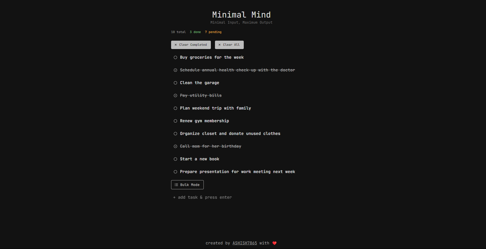

# Minimal Mind

[](https://reactjs.org/)
[](https://www.typescriptlang.org/)
[](https://mui.com/)
[](https://vitejs.dev/)
[](https://opensource.org/licenses/MIT)

Minimal Mind is a sleek, minimalist todo application that embodies the principle of "Minimal Input, Maximum Output." Built with React, TypeScript, and Material-UI, it provides a clean and efficient interface for managing your tasks.



## ✨ Features

- ✅ Add, edit, and delete tasks
- 🔄 Mark tasks as completed or pending
- 🧹 Clear all completed tasks
- 💾 Persistent storage using localStorage
- 📱 Responsive design for various screen sizes
- 🌙 Dark mode theme for reduced eye strain
- 📝 Bulk task addition mode

## 🚀 Getting Started

### Prerequisites

- Node.js (version 14 or later)
- npm or yarn

### Installation

1. Clone the repository:
   ```sh
   git clone https://github.com/yourusername/minimal-mind.git
   cd minimal-mind
   ```

2. Install dependencies:
   ```sh
   npm install
   # or
   yarn install
   ```

3. Start the development server:
   ```sh
   npm run dev
   # or
   yarn dev
   ```

4. Open your browser and visit `http://localhost:5173` to see the application running.

## 🏗️ Building for Production

To create a production build, run:
```sh
npm run build
# or
yarn build
```

The built files will be in the `dist` directory.

## 🧱 Project Structure

```
minimal-mind/
├── src/
│ ├── components/
│ │ ├── providers/
│ │ ├── screen/
│ │ └── ui/
│ ├── App.tsx
│ ├── theme.tsx
│ └── main.tsx
├── public/
├── package.json
└── README.md
```


## 🛠️ Technologies Used

- [React](https://reactjs.org/)
- [TypeScript](https://www.typescriptlang.org/)
- [Material-UI](https://mui.com/)
- [Vite](https://vitejs.dev/)
- [Emotion](https://emotion.sh/) (for styled components)
- [Lucide React](https://lucide.dev/) (for icons)
- [nanoid](https://github.com/ai/nanoid) (for generating unique IDs)

## 🤝 Contributing

Contributions are welcome! Please feel free to submit a Pull Request.

1. Fork the project
2. Create your feature branch (`git checkout -b feature/AmazingFeature`)
3. Commit your changes (`git commit -m 'Add some AmazingFeature'`)
4. Push to the branch (`git push origin feature/AmazingFeature`)
5. Open a Pull Request

## 📄 License

This project is open source and available under the [MIT License](LICENSE).

## 🙏 Acknowledgements

- [React](https://reactjs.org/)
- [Material-UI](https://mui.com/)
- [Vite](https://vitejs.dev/)
- [TypeScript](https://www.typescriptlang.org/)

## 📬 Contact

Ashish - Jaiswalashish9467@gmail.com

Project Link: [https://github.com/ASHISH7865/minimal-mind](https://github.com/ASHISH7865/minimal-mind)

## 🚀 Future Enhancements

- 🔍 Advanced search and filtering options
- 🏷️ Task categorization with tags or labels
- 📅 Due date and reminder functionality
- 📊 Task priority levels
- 📈 Progress tracking and productivity insights
- 🔗 Task linking and dependencies
- 🔄 Sync across devices (cloud integration)

- 🔔 Push notifications for task reminders
- 📱 Mobile app versions (iOS and Android)
- 🌐 Multi-language support
- 🎨 Customizable themes and color schemes
- 📤 Export/import tasks functionality
- 👥 Collaborative task management for teams

1. 🔒 User authentication and personalized task lists
2. 🔁 Recurring tasks functionality
3. 📎 File attachments for tasks
4. 🗣️ Voice input for adding tasks
5. 📊 Kanban board view for task management
6. 🕒 Time tracking for tasks
7. 🔗 Integration with popular productivity tools (e.g., Calendar, Slack)
